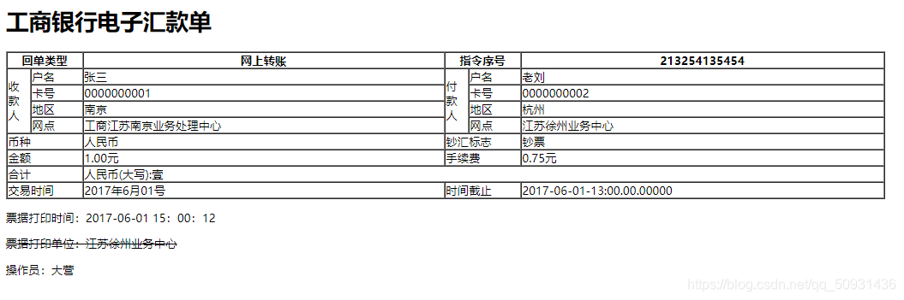

# 学习记录：CSS 基础(一)

[TOC]

# 一、CSS 概述

## 1.1 什么是 CSS？

CSS 是“Cascading Style Sheet”的缩写，中文意思为“**层叠样式表**”（层层叠加的样式），它是一种标准的**样式表语言**，用于描述网页的表现形式（例如网页元素的位置、大小、颜色等）。

CSS 的**主要作用是定义网页的样式**（美化网页），对网页中元素的位置、字体、颜色、背景等属性进行精确控制。CSS 不仅可以静态地修饰网页，还可以配合 JavaScript 动态地修改网页中元素的样式，而且市面上几乎所有的浏览器都支持 CSS。

## 1.2 CSS 优点

- 将 HTML 文档的表现与内容分离
- 使 HTML 文档结构简化/清晰/灵活
- 极大的提高了 HTML 文档的可读性
- [Cascading](https://so.csdn.net/so/search?q=Cascading&t=&u=&urw=)使样式结构简化/清晰/灵活
- 增强了网站全局的一致性
- CSS 文件存储在浏览器的高速缓存中，多个页面不必重新装载分析样式，降低网络数据传输
- 便于针对不同设备目标定制不同的样式

## 1.3 CSS 特点

- 丰富的样式定义
- 易于使用和修改
- 多页面应用
- 层叠
- 页面压缩

---

# 二、CSS 语法

## 2.1 语法规范

**选择器 + 若干属性声明**

如图：


> **注意：不要在属性值与单位之间留有空格！**

如下图：
错误方法(有空格)：


正确方法(无空格)：


## 2.2 注释

CSS 注释以 /_ 开头，以 _/ 结尾

---

# 三、CSS 选择器

## 3.1 元素选择器

**元素选择器基于元素名称(类型)，选择所有相同元素**

代码如下：

```HTML
<style>
      p {
        color: blue;
      }
</style>
```

```html
<p>Lorem ipsum dolor sit.</p>
<p>Cupiditate, impedit? Est, tenetur.</p>
<p>Dolores ratione enim placeat.</p>
```

效果如下(**影响页面所有 p 元素**)：


## 3.2 id 选择器

**ID 选择器基于 HTML 元素的 ID 属性来选择特定的元素**

- 使用`#id名`，定义 id 选择器
- 元素 id 应在一个页面内具有唯一性
- ID 名称不能以数字开头

代码如下：

```html
<style>
  #para1 {
    color: aqua;
  }
</style>
```

```html
<p id="para1">Lorem ipsum dolor sit.</p>
<p>Cupiditate, impedit? Est, tenetur.</p>
<p>Dolores ratione enim placeat.</p>
```

效果如下(**仅影响 id 为 para1 的元素**)：


> 注意：Id=para1 的 p 元素样式由 p 选择器，以及 id 选择器**层叠**决定

## 3.3 class 选择器

**class 选择器基于 HTML 元素 class 属性值，选择一组特定的元素**

- 使用`.class名`，定义 class 选择器
- 定义一类样式，可针对不同类型元素

代码如下：

```html
<style>
  .center {
    text-align: center;
  }
</style>
```

```html
<p class="center">Cupiditate, impedit? Est, tenetur.</p>
<div class="center">Dolores ratione enim placeat.</div>
<h3 class="center">Lorem ipsum dolor sit.</h3>
```

效果如下(**不同类型元素可以引用相同的 class**)：


---

> **可以指定只有特定的元素受 class 的影响 (元素.类名)**

代码如下：

```html
<style>
  h3.center {
    text-align: center;
  }
</style>
```

效果如下(指定 h3)：


---

> **一个元素可以同时引用多个 class(空格间隔)**

代码如下：

```html
<style>
  .center {
    text-align: center;
  }
  .red {
    color: crimson;
  }
</style>
```

```html
<p class="center">Cupiditate, impedit? Est, tenetur.</p>
<div class="center">Dolores ratione enim placeat.</div>
<h3 class="center red">Lorem ipsum dolor sit.</h3>
```

效果如下：


## 3.4 最小化

**当多个选择器具有相同属性时最小化代码**

```html
<style>
  h1 {
    text-align: center;
    color: red;
  }
  p {
    text-align: center;
    color: red;
  }
  h2 {
    text-align: center;
    color: red;
  }
</style>
```

上述代码最小化为(使用逗号分隔)：

```html
<style>
  h1,
  p,
  h2 {
    text-align: center;
    color: red;
  }
</style>
```

---

# 四、样式表

当浏览器读取到样式表，将根据样式表中的信息格式化 HTML 文档
插入样式表方法：

- 外部样式表
- 内部样式表
- 内联样式

> **样式表优先级：内联样式 > 内部样式表 > 外部样式表**

层叠顺序(Cascading Order)
不同样式表定义不同属性值，所有的样式会根据规则层叠于一个新的虚拟样式表中，按刷入顺序，后定义样式覆盖前定义样式，优先级由低至高：

- 浏览器缺省设置
- 外部样式表
- 内部样式表
- 内联样式

**！因此，必须按顺序正确加载 CSS 样式！**


## 4.1 外部样式表

- 样式需要应用于很多页面，可以通过改变一个文件来改变整个站点的外观，**每个页面均需引入 CSS 文件**
- 每个页面都必须在`<link>`元素内包含对外部样式表文件的引用。`<link>`在 HTML 页面的`<head>`部分中
- 外部样式表文件不应包含任何 HTML 标记, 必须保存为`. css扩展名`

如图所示：


---

## 4.2 内部样式表

- 如果单个页面具有独特的样式，则可以使用内部样式表。
- 内部样式是在`<style>`元素中定义的，在 HTML 页面的`<head>`部分中

如图所示：


## 4.3 内联样式

- 内联样式，当仅需要在一个元素上应用一次时
- 表现与内容混淆，内联样式会失去 CSS 的许多优势
- 网站必须提供一致性主题/体验，例如所有表格应使用相同样式，标题统一蓝色背景等，将样式定义在元素，则后期无法维护

如图所示：


# 五、总结

记录自己的学习过程，温故知新
