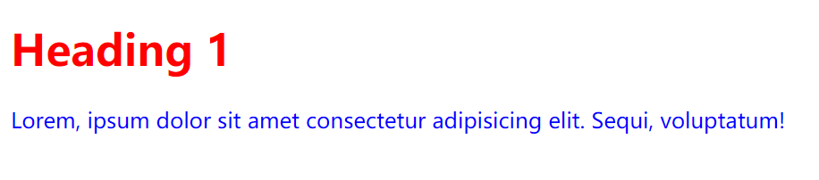

# 学习记录：CSS Background、Image、Text、Opacity

[TOC]

# 一、背景 Background

## 1.1 background 概述

CSS 的 background 属性是我们进行网页布局和设计时不可或缺的一部分，它为元素提供了**丰富的背景绘制能力**，包括颜色、图像、渐变、重复模式、定位、剪裁等。

|         属性          |                     说明                     |
| :-------------------: | :------------------------------------------: |
|      background       |           在一个声明中设置所有属性           |
| background-attachment | 设置背景图像是固定的还是随页面的其余部分滚动 |
|   background-color    |               设置元素的背景色               |
|   background-image    |              设置元素的背景图像              |
|  background-position  |            设置背景图像的起始位置            |
|   background-repeat   |            设置背景图像的重复方式            |

background-color 示例代码如下:

```css
body {
  background-image: url(images/background背景示例图片.jpg);
}
h1 {
  background-color: green;
}
div {
  background-color: lightblue;
}
p {
  background-color: yellow;
}
```

```html
<body>
  <h1>CSS background-color example</h1>
  <div>
    Lorem ipsum dolor sit, amet consectetur adipisicing elit. Cumque, possimus.
    <p>Lorem ipsum dolor, sit amet consectetur adipisicing elit. Molestiae, in!</p>
    Lorem ipsum dolor sit amet consectetur adipisicing elit. Maiores, autem.
  </div>
</body>
```

效果如下：


> 默认横纵均重复的背景图片

---

## 1.2 background 速记属性

背景速记属性值的顺序为

- background-color
- background-image
- background-repeat
- background-attachment
- background-position

示例代码如下：

```css
body {
  background: #fff url(images/background背景示例图片.jpg) no-repeat right top;
}
```

效果如下：


---

# 二、图像 Image

**img 图片元素详解**

## 2.1 半径 radius

示例代码如下：

```css
img.radius01 {
  border-radius: 12px;
}
img.radius02 {
  border-radius: 50%;
}
```

```html


```

效果如下：

> 示例 1：加圆角 8px
> 

> 示例 2：加圆角 50%
> 

---

## 2.2 Object-Fit 属性

**Object-Fit 属性用于指定图片或视频如何适应其容器**

- fill，默认值，缩放填充整合容器
- contain，等比例缩放，填充容器
- cover，等比例缩放，直到高宽任一完全填充，元素居中后，2 边剪裁至容器大小

示例代码如下：

```css
.thumb {
  width: 100px;
  height: 150px;
}
.thumb1 {
  object-fit: cover;
}
.thumb2 {
  object-fit: contain;
}
```

```html


```

效果如下：

> 示例 1：图片实际尺寸与默认尺寸不同时，默认为自动缩放(容器为 100\*150)
> 

> 示例 2：等比例缩放，直到高或宽任一边完全相等，居中后，两边剪裁
> 

> 示例 3：等比例缩放，填充容器
> 

---

## 2.3 尺寸

### 2.3.1 max-width

> 当窗口尺寸小于图片实际尺寸时,仅随窗口缩小

```css
.responsive {
  max-width: 100%;
  height: auto;
}
```

> 无论图片实际尺寸,随窗口缩放

```css
.responsive2 {
  width: 100%;
  height: auto;
}
```

---

### 2.3.2 max-height

当容器尺寸小于内部元素尺寸时，会使元素溢出

示例代码如下：

```css
#img {
  height: 200px;
  border: 1px solid red;
}
```

```html
<div id="img">
  
</div>
```

效果如下：


> **修改方法：显式声明元素最大尺寸为容器尺寸**

修改代码如下：

```css
#img {
  height: 200px;
  border: 1px solid red;
}
#img img {
  max-height: 100%;
}
```

效果如下：


---

### 2.3.3 延迟加载属性

loading="lazy"属性支持延迟加载图片。在浏览器真正需要渲染显式图片时(具体由各浏览器决定，一般为滚动到需要展示图片时)加载图片，而非打开页面即加载。
当页面中图片过多时，浏览器仅需先加载首屏展示图片，可避免占用网络资源提高页面渲染效率。

代码如下：

```html

```

---

# 三、文本 Text

**text 文本样式能提升页面美观度、用户体验，并传达信息重点，提高网站可访问性，标识网站风格**

|      属性       |                                      说明                                       |
| :-------------: | :-----------------------------------------------------------------------------: |
|      color      |                                 设置文本的颜色                                  |
|    direction    |                              指定文字方向/书写方向                              |
| letter-spacing  |                         增加或减少文本中字符之间的间距                          |
|   line-height   |                                   设置行高度                                    |
|   text-align    |                             指定文本的水平对齐方式                              |
| text-decoration |                              指定添加到文本的修饰                               |
|   text-indent   |                            指定文本块中第一行的缩进                             |
|   text-shadow   |                            指定添加到文本的阴影效果                             |
| text-transform  |                                控制文本的大小写                                 |
|  text-overflow  |                   指定应如何向用户发出未显示的溢出内容的信号                    |
|  unicode-bidi   | 与 Direction 属性一起使用，以设置或返回是否应重写文本以支持同一文档中的多种语言 |
| vertical-align  |                             设置元素的垂直对齐方式                              |
|   white-space   |                            指定如何处理元素中的空白                             |
|  word-spacing   |                         增加或减少文本中单词之间的间距                          |

---

## 3.1 颜色 color

示例代码如下：

```css
body {
  color: blue;
}
h1 {
  color: red;
}
```

效果如下：


---

## 3.2 text-align

text-align 属性值：

- center
- right
- left
- justify(两端对齐)

示例代码如下：

```css
h1 {
  text-align: center;
}
h2 {
  text-align: right;
}
h3 {
  text-align-last: left;
}
```

效果如下：


justify 示例代码如下：

```css
div.justify {
  padding: 10px;
  border: 1px solid #000;
  text-align: justify;
}
```

效果如下：


---

## 3.3 text-decoration

text-decoration 属性值：

- none
- overline
- line-through
- underline

示例代码如下：

```css
h1 {
  text-decoration: overline;
}
h2 {
  text-decoration: line-through;
}
h3 {
  text-decoration: underline;
}
a {
  text-decoration: none;
}
```

效果如下：


---

## 3.4 text-indent

**指定文本块中第一行的缩进**

示例代码如下：

```css
p {
  text-indent: 50px;
}
p.ch {
  text-indent: 2em;
}
```

效果如下：


---

## 3.5 white-space

**white-space 属性，用于设置如何处理元素内的空白字符。即无需使用`<pre>`标签**

- normal，连续的空白符会被合并。源码中的换行符会被当作空白符来处理。并根据填充行框盒子的需要来换行。

- pre-wrap，连续的空白符会被保留。在遇到换行符或 `<br>`元素时，或者根据填充行框盒子的需要换行

示例如下：


---

# 四、字体 Font

**CSS 字体属性定义文本的字体系列、粗体、大小和样式**


> 在计算机屏幕上，无衬线字体被认为比衬线字体更容易阅读

|     属性     |                 说明                 |
| :----------: | :----------------------------------: |
|     font     |     在一个声明中设置所有字体属性     |
| font-family  |          指定文本的字体系列          |
|  font-size   |          指定文本的字体大小          |
|  font-style  |          指定文本的字体样式          |
| font-variant | 指定文本是否应以小型大写字母字体显示 |
| font-weight  |            指定字体的粗细            |

> - 支持设置字体主题类型(宋体等)/字体样式/尺寸/粗细等
> - 普通文本，段落等字体尺寸按 16px 计算，即 1em

---

## 4.1 font-style

**font-style 属性指定文本的字体样式**

font-style 属性值：

- normal 默认值。浏览器显示一个标准的字体样式。
- italic 浏览器会显示一个斜体的字体样式。
- oblique 浏览器会显示一个倾斜的字体样式。
- inherit 规定应该从父元素继承字体样式。

---

## 4.2 font-weight

|   值    |           描述           |
| :-----: | :----------------------: |
| normal  | 默认值。定义标准的字符。 |
|  bold   |      定义粗体字符。      |
| bolder  |     定义更粗的字符。     |
| lighter |     定义更细的字符。     |

---

## 4.3 font-family

**font-family 属性应该设置几个字体名称作为一种"后备"机制，如果浏览器不支持第一种字体，他将尝试下一种字体**

如图所示：


---

# 五、不透明度 Opacity

> - **不透明度属性指定元素的不透明度/透明度。**
> - **不透明度属性可以从 0 中取值。0-1。没有。值越低，透明度越高**

示例代码如下：

```css
div {
  background-color: green;
}
.op1 {
  opacity: 0.1;
}
.op2 {
  opacity: 0.5;
}
.op3 {
  opacity: 0.8;
}
.op4 {
  opacity: 1;
}
```

```html
<div class="op1">opacity 0.1</div>
<div class="op2">opacity 0.5</div>
<div class="op3">opacity 0.8</div>
<div class="op4">opacity 1.0</div>
```

效果如下：


**容器透明度，会影响容器内元素的透明度。因此，有时需要容器背景色透明，而非容器透明,可声明容器背景色透明**

示例代码：
`background: rgba(0, 0, 0, 0.2);`

效果如下：


---

# 六、总结

记录自己的学习过程，温故知新
