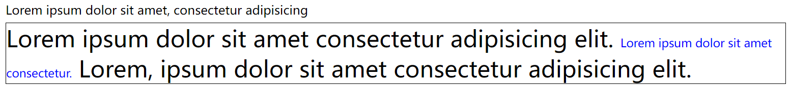
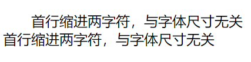
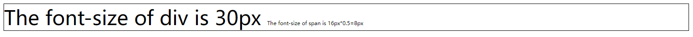

# 学习记录：CSS Units&Box Model

[TOC]

# 一、Units

## 1.1 Units 概述

Units 是 CSS 单位，CSS 有几种不同的单位来表示长度，许多 CSS 属性采用“长度”值，如宽度、边距、填充、字体大小、边框宽度等。对于某些 CSS 属性，**允许使用负长度**

**长度单位有两种类型:**

- 相对长度单位
- 绝对长度单位

---

## 1.2 相对长度单位

**相对长度单位指定相对于另一个长度特性的长度**。相对长度单位在不同渲染介质之间的缩放效果更好。
|单位| 描述|
|:-:|:-:|
|em| 相对于当前字体的字体大小(2em 表示当前字体大小的 2 倍)|
|ex| 相对于当前字体的 X 高度(很少使用)|
|ch| 相对于数字“ 0 ”的宽度|
|rem| 相对于根元素的字体大小|
|vw| 相对于视口宽度的 1%_|
|vh| 相对于视口高度的 1%_|
|vmin| 相对于视口*较小尺寸的 1%|
|vmax| 相对于视口*较大尺寸的 1%|
|%||

---

### 1.2.1 em

**em，相对于当前元素应有尺寸的倍数**

代码如下：

```html
<style>
  #px1 {
    font-size: 16px;
    line-height: 2px;
  }
  #px2 {
    font-size: 30px;
    border: 1px solid black;
  }
  #em1 {
    font-size: 0.5em;
    color: blue;
  }
</style>
```

```html
<p id="px1">Lorem ipsum dolor sit amet, consectetur adipisicing</p>
<div id="px2">
  Lorem ipsum dolor sit amet consectetur adipisicing elit.
  <span id="em1">Lorem ipsum dolor sit amet consectetur.</span>
  Lorem, ipsum dolor sit amet consectetur adipisicing elit.
</div>
```

效果如下：


> div 内字体为 30px，span 的 em 则相对于 30px 的 0.5 倍,最终字体为 15px

**应用场景：首行缩进，使用相对单位，与字体 px 尺寸无关**

首行缩进代码如下：

```html
<style>
  #indent {
    text-indent: 2em;
  }
</style>
```

```html
<p id="indent">
  首行缩进两字符，与字体尺寸无关
  <br />
  首行缩进两字符，与字体尺寸无关
</p>
```

首行缩进效果如下：


---

### 1.2.2 rem

**rem 相对于根，即 html 元素设置的尺寸，在没有显式声明时。浏览器默认 html 字体为 16px**

代码如下：

```html
<style>
  #rem1 {
    font-size: 30px;
    border: 1px solid #000;
  }
  #rem2 {
    font-size: 0.5rem;
  }
</style>
```

```html
<div id="rem1">
  The font-size of div is 30px
  <span id="rem2">The font-size of span is 16px*0.5=8px</span>
</div>
```

效果如下：


> **rem 相对于 html 设置，而非当前尺寸**

---

### 1.2.3 %

**%，相对于父容器设置的百分比**

代码如下：

```html
<style>
  #father {
    width: 80%;
    font-size: 30px;
    border: 1px solid #000;
  }
  #son {
    width: 50%;
    font-size: 80%;
    border: 1px solid #000;
  }
</style>
```

```html
<div id="father">
  father
  <div id="son">son</div>
</div>
```

效果如下：


> - father 为当前宽度的 80%
> - son 为 father 宽度的 50%
> - son 的 font-size 为 Father 的 80%

## 1.3 绝对长度单位

**绝对长度单位是固定的，用其中任何一种单位表示的长度都将精确地显示为该大小**
像素(CSS Pixel)，像素长度和你在显示器上看到的文 字屏幕像素无关，实际上是一个按角度度量的单位，CSS 样式中的逻辑像素
|单位 |说明|
|:-:|:-:|
|cm| 厘米|
|mm| 毫米|
|in| 英寸(1in=96px=2.54cm)|
|px| 像素(1px=1 英寸的 1/96)|
|pt| 点数(1pt=1 英寸的 1/72)|
|pc|派卡(1pc=12pt)|
